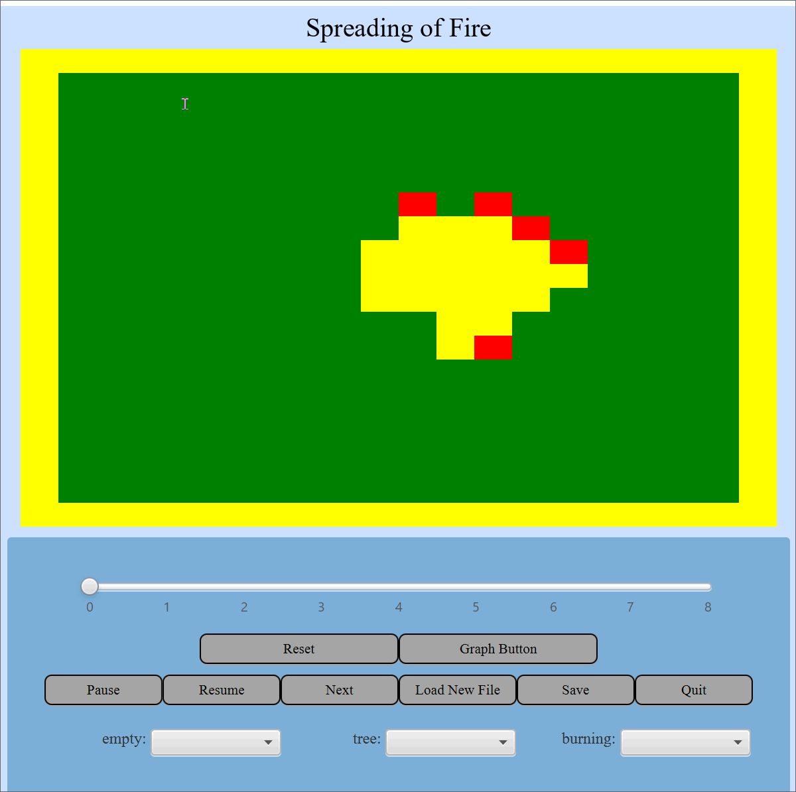

Simulation
====

This project implements a cellular automata simulator.

Names: Umika Paul, Yasser Elmzoudi, Fernanda Rizo

### Timeline

Start Date: 10/03/20

Finish Date: 10/19/20

Hours Spent: 180

### Primary Roles

All: Each member helped and worked with other members to implement their portions of the project. Each part of the project involved contributions from all members.

Umika Paul: Responsible for the backend of the project. She made the abstract classes, enum, and concrete classes for the Cell and Grid to allow for proper functioning of the six simulations. She was also responsible for implementing the different edge and neighborhood policies. She wrote all the tests for these classes. 

Fernanda Rizo: Responsible for the frontend of the project. She was responsible for the classes including the GamePane, ScreenVisuals, and ButtonPanel. She worked to make the simulation more user interactive through implementing colors, styles, and languages. She wrote the tests for these classes.

Yasser Elmzoudi: Responsible for configuration and exceptions. He wrote the classes encapsulating the exceptions and ErrorPanel, and was responsible for proper functioning of the graph. He also separated the controller from the view and helped structure the code. 

### Resources Used

Professor Duvall's lectures and notes from class
- Examples of reflection
- Abstractions

StackOverFlow
- JavaFX Features
- Reflection

### Running the Program

Main class:

Start: Contains the method to <code>launch args</code> and run the program.

Data files needed: 

All the data csv files are located in the data folder. The properties files are located in the resources directory in src, and the properties files for the languages are located in the languageresources directory. The css files are located in the styleresources directory.

Note: For the tests, some of the files needed to run the tests are in the <code>Test Sources</code> folder. This folder needs to be set as the Test Resources root.

Features implemented:

- There are six different simulations included - Game of Life, Percolation, Segregation, Rock Paper Scissors, Predatory Prey, and Spreading of Fire.

Game of Life

Spreading of Fire

- Different edge policies: These include Finite, Klein Bottle, and Torodial.
- Different neighborhood policies: These include Complete, Diagonal, and Cardinal.
- Three languages: English, Spanish, and French.
- Simulation graph: Represents the number of each type of state in the simulation across time.
- Ability to load new files, pause, reset, change speed, and step through simulation.
- Different shapes in grid: Triangle, Hexagon, and Rectangle.
- Style of Cells: Both images and different colors can be loaded onto the cells.
- Different Themes: A few different colors / themes can be loaded upon startup into the simulation.
- Exception handling.

### Notes/Assumptions

Assumptions or Simplifications:

Interesting data files:

In particular, the Predator Prey simulation is interesting when the sharks (originally dark blue) are set to "Shark Image" and the fish (originally turquoise) are set to "Fish Image" while the water is set to "Water Image."

The Spreading of Fire simulation is also interesting. One tree starts off burning and you can see the fire growing outwards.

Known Bugs:

Extra credit:

Different styles
- Different colors for the cells
- Different languages can be chosen upon startup
- Different images
- Grids are outlined for the simulations with a large number of cells for easier identification.

User Interactive Mode
- Ability to dynamically change the speed of the simulation through an interactive slider.

Different Shapes
- Triangle Grid
- Hexagon Grid
- Rectangle Grid

### Impressions

Umika Paul: Working on the simulations was definitely a lot of work, but it was enjoyable to see the end product each of the simulations functioned properly. Helping out with each portion of the project gave me exposure to both frontend and backend work for this project and I learned a lot from applying the principles taught in class such as abstraction and reflection. I also had a great time working with my team, who were collaborative and dedicated.

Yasser Elmzoudi:

Fernanda Rizo:
