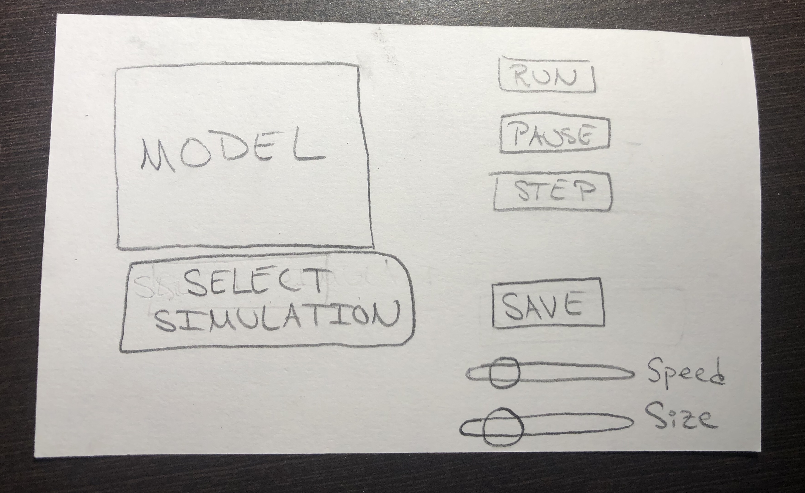

# Simulation Design Plan
### Team Number 
- 13
### Names
- Yasser Elmzoudi (ye9)
- Umika Paul (usp3)
- Fernanda Ruiz (fec6)


## Design Overview
* The `Cell` class should store the current state of each cell and contains the corresponding relationships between different cell states.
* The `Grid` class will be responsible for creating a 2D grid of rectangular cells.
* The `GridReader` class will read the grid’s dimensions and the initial cell states of the grid from a CSV formatted file.
* The `Visualization` class will be responsible for showing.the simulation based on the current cell states of the grid.
* The `UserInterface` class will allow the user to pause, step through, resume, or save a current simulation. The user will also have the option to load or choose a different simulation file.
* We also intend to create an abstract class that can be extended to create different types of simulations.
* We also hope to implement Enum to be able to choose between different simulation files quickly.

- Commonalities between models:
    - Dynamic cells that change based upon certain conditions
    - Element of replication (creating same Objects multiple times and populating respective cells accordingly)
    - Characteristics of cells depend on neighboring cells and the Objects therein
    - Potential method to determine if Update is necessary for current cell and for neighboring cells
    - initialize method could creat Grid and populate all of the cells accordingly
    - Elements in a potential configuration file:
        - Size of Grid
        - Type of simulation 
        
- Potential Classes:
    - `Cell` abstract class
    - `Grid` class
    - Enum to generate different types of Cells
    - `GridReader` class
    - `GridWriter` class
    - `NeighboringCells` interface
    - `Display` class
    - `Controller` class
   
This class's purpose or value is to define the different possible types of cells:
```java
public abstract class Cell implements NeighboringCells {
    public void update();
    public String getState();
    public void setState(String state);
    public void createCell(Enum cellType);
    public int countOfNeighboringStates(List<Cells> neighboringCells, String state);
    public String getNextState();
}
```

This interface contains the necessary methods for retrieving and updating neighboring cells:
```java
public interface NeighboringCells {
    public List<Cell> getNeighbors();
    public void updateNeighbors();
}
```

This class's purpose or value is to define and populate the layout of Cells:
```java
public class Grid {
    public void setUp(String fileName);
    public List<Cell> getCells();
    public void updateDisplay();
    public void changeSimulation(String simulation); //Updates the simulation applied to all cells (changing their type) by reading new simulation states from file
    public String getSimulation();
    public void updateSimulation(String newSimulation) //called within changeSimulation
}
```

This class's purpose or value is to read in the layout of the Grid:
```java
public class GridReader {
    public void readGrid(String fileName);
}
```

This class's purpose or value is to write the final state of a Grid to a file:
```java
public class GridWriter {
    public void writeGrid(String fileName);
}
```

This class's purpose or value is to Display the Model to users:
```java
public class Display {
    public Scene makeScene(int width, int height);
    public void updateDisplay(Scene model);
}
```

This class's purpose or value is to interact between the Model and the Display:
```java
public class Controller {
    public void showModel(Grid cells);
    public void showError (String message);
}
```

This Enum's purpose is to represent the different types of Cells:
```java
public enum cellType {
    public Cell createCell(int row, int column);
}
```
## Design Details

* The `SimulationVisualizer` class collaborates with the Cell class to be able to determine whether a Cell should be displayed as ‘Alive’ or ‘Dead’. It then changes the cell color based on the state of the cell and its neighboring cells.
* `Grid` initializes a grid based on the data file. It converts the data file into a 2D grid, obtains the neighboring cells, and updates them with rules of the game.
* Abstract class to handle different kinds of simulations, with each subclass containing the rules for a single simulation.
* `GridReader` reads all the lines from a given file.
* `Cell` encapsulates the logic for returning whether the cell is alive or dead, and updates them according to the rules.

* Use Cases:
    * Apply the rules to a cell: set the next state of a cell to dead by counting its number of neighbors using the Game of Life rules for a cell in the middle (i.e., with all of its neighbors)
    ```java
    for (Cell currentCell: grid.getCells()) {
      if (currentCell.getState().equals("alive")) {
        int count = countOfNeighboringStates(currentCell.getNeighbors, "alive")
        if (count < UNDERPOPULATION) {
          currentCell.setState("dead");
            }
        else if (count == 2 || count == 3) {
          currentCell.setState("alive");
        }
        else if (count > OVERPOPULATION) {
          currentCell.setState("dead");
        }
        else if (count == 3) {
          currentCell.setState("alive")
        }
      }
    } 
  ```
    
    * Move to the next generation: update all cells in a simulation from their current state to their next state
    ```java
    for (Cell currentCell: grid.getCells()) {
        currentCell.setState(currentCell.getNextState())
    }
    ```
    
    * Switch simulations: load a new simulation from a data file, replacing the current running simulation with the newly loaded one
    ```java
    FileWriter previousModel = new FileWriter();
    previousModel.writeFile(grid.getSimulation());
    grid.changeSimulation(newSimulation); //reads from File as well
    ```


## Design Considerations

* At this point, we are unsure as to what methods would be common to all simulations. Hence, it was difficult to construct many abstract classes or inheritance hierarchies at this point.
    * Potential abstract `Cell` and `Grid` classes whose subclasses would be constructed based off an `enum`
* Understanding the functionality of `Controller` and how it communicates between `Model` and `View`
    * Ensure that these packages adhere to the Single Responsibility Principle and only contain the information necessary for the completion of their appropriate functions
## User Interface

Diagram of Planned User Interface:



* Model
    * Display of the current simulation
* Select Simulation Button
    * Gives users the option to select a new simulation configuration file and display it in Model
* Run Button
    * Runs the simulation at the selected speed
* Pause Button
    * Pauses the simulation
* Step Button
    * Steps through one iteration of the simulation
* Save Button
    * Saves the current state of the model
* Speed Slider
    * Adjusts the speed of the simulation
* Size Slider
    * Adjusts the size of the cells (the smaller the cells, the larger the grid)


## Team Responsibilities

 * Fernanda
    * Front End (Simulation Visualizer and File Chooser)
 * Umika
    * Backend(Models)
 * Yasser
    * Backend(Configuration and Models)

